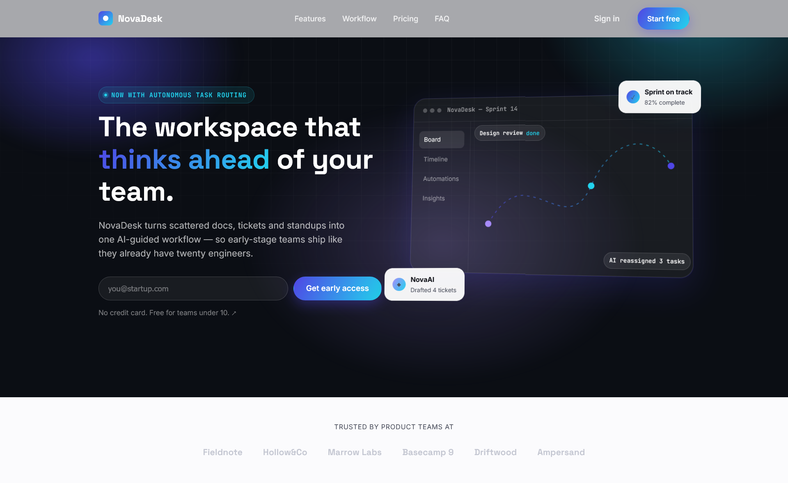
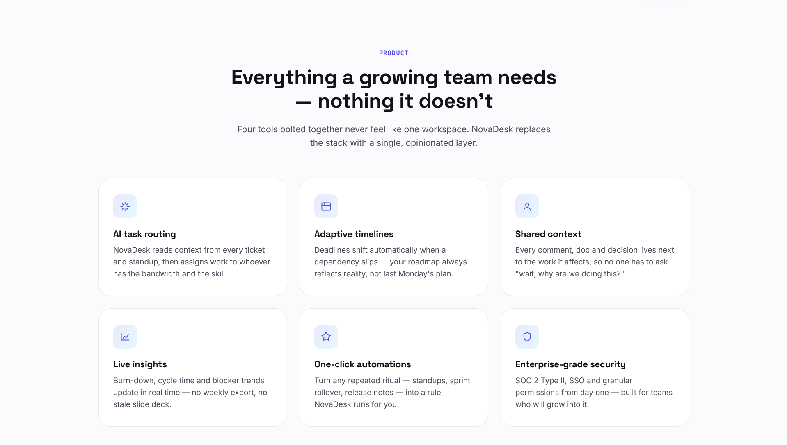
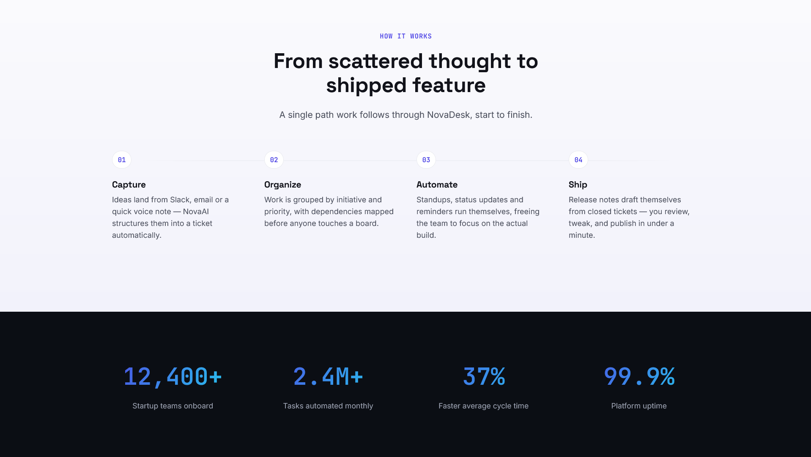
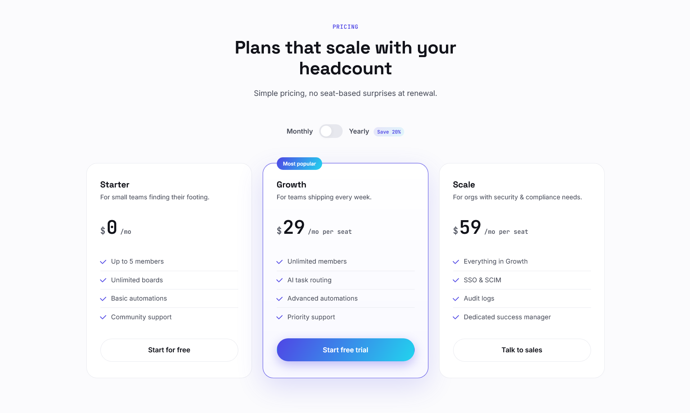
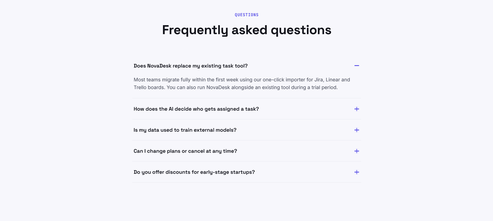
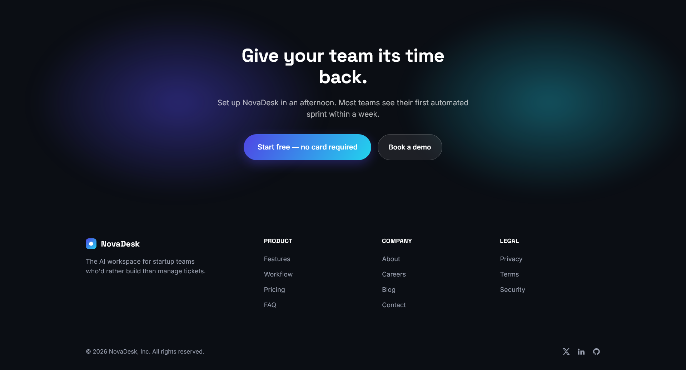

# 💻 NovaDesk Landing

A premium SaaS landing page built using HTML, CSS and JavaScript.

NovaDesk Landing is designed as a modern product landing page inspired by today's SaaS websites. The focus was on clean layouts, visual hierarchy and responsive design.

## Live Demo

https://aman-luc.github.io/NovaDesk-Landing/

## Features

- Hero Section
- Product Features
- Pricing Section
- Testimonials
- FAQ Section
- Responsive Layout
- Modern UI
- Smooth Navigation

## Tech Stack

- HTML5
- CSS3
- JavaScript

## Project Goal

The purpose of this project was to practice building high-quality SaaS landing pages with a strong emphasis on user experience and frontend design.

## Preview

## 📸 Preview

### Hero Section

### Features

### WorkFlow

### Pricing

### FAQ

### Footer

## Author

Aman Kumar

GitHub:
https://github.com/Aman-luc
